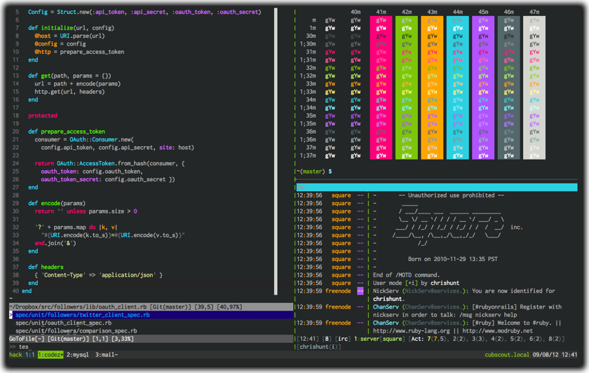

# Thayer iTerm2/Vim Color Scheme

**Vim** | [Vimbrant](https://bitbucket.org/thayerwilliams/vimbrant/src/8abddd01c05e/vimbrant.vim), by Thayer Williams

    $ cp vimbrant.vim ~/.vim/colors/vimbrant.vim
    $ vim ~/.vimrc

      " ~/.vimrc
      set background=dark
      colorscheme vimbrant
      highlight ColorColumn ctermbg=7
      highlight ColorColumn guibg=Gray

**iTerm2** | [Thayer (Vimbrant clone)](https://github.com/baskerville/iTerm-2-Color-Themes/blob/master/thayer.itermcolors), by Bastien Dejean

    $ open thayer.itermcolors  # adds to iTerm color list
    $ vi ~/.tmux.conf

      # ~/.tmux.conf
      set -g status-bg colour235
      set -g status-fg white

      set-window-option -g window-status-current-fg black
      set-window-option -g window-status-current-bg green

      set -g pane-border-fg colour235
      set -g pane-border-bg black
      set -g pane-active-border-fg green
      set -g pane-active-border-bg black
